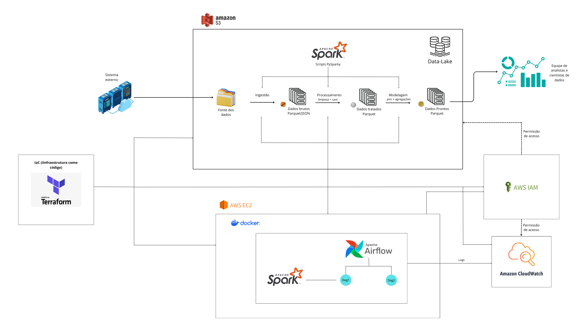

# ETL Pipeline AWS Real Case 

## 🎯 Objetivo do Projeto

Construção de pipelines **ETL no Amazon EC2** utilizando **Apache Spark** e orquestradas pelo **Apache Airflow**, para processar e transformar dados brutos das áreas de **Clientes** e **Vendas**, gerando camadas intermediárias (`processed`) e finais (`gold`) diretamente no **Amazon S3**, seguindo boas práticas de engenharia de dados, modularidade de código e padrões corporativos.

## 🧩 Arquitetura do Projeto



### 🧪 **Ambiente de Execução**

O ambiente foi construído utilizando contêineres Docker orquestrados via `docker-compose`, com **Apache Airflow** como orquestrador de tarefas e **Apache Spark** como motor de processamento distribuído.

---

### ✅ 1. Pré-requisitos

- Conta ativa na **AWS**
- Chave de acesso (`.pem`) para conexão via SSH
- **AWS CLI** configurada localmente (`aws configure`)

## 🚀 2. Clonar o Repositório

```bash
git clone https://github.com/MatheusNBrito/etl-pipeline-aws-real-case.git
cd etl-pipeline-aws-real-case

## ⚙️ 3. Ajustes Necessários

Editar apenas o essencial:

- Arquivo: `IaC/terraform.tfvars`

    Ajustar o valor da chave SSH:

    ```hcl
    key_name = "nome-da-sua-chave-aws.pem"
    ```

- Demais variáveis (`bucket_name`, `instance_type`, etc.) só alterar se necessário.

## ☁️ 4. Provisionar a Infraestrutura com Terraform (via container)

Dentro da pasta `IaC/`:

### 🔹 Inicializar o Terraform:

```bash
docker run -it --rm \
  -v $(pwd):/app \
  -w /app \
  hashicorp/terraform:light init

### 🔹 Aplicar o Terraform:

```bash
docker run -it --rm \
  -v $(pwd):/app \
  -w /app \
  -e AWS_ACCESS_KEY_ID=$(aws configure get aws_access_key_id) \
  -e AWS_SECRET_ACCESS_KEY=$(aws configure get aws_secret_access_key) \
  hashicorp/terraform:light apply -var-file=terraform.tfvars

## 🔐 5. Conectar na Instância EC2

Antes de conectar, ajuste as permissões da chave:

```bash
chmod 400 ~/.ssh/nome-da-chave.pem

Utilize o comando abaixo substituindo pelo nome da sua chave `.pem` e o IP público da instância:

```bash
ssh -i "nome-da-chave.pem" ubuntu@<IP-Publico-da-EC2>

## ⚙️ 6. Preparação dentro da EC2

Após conectar na EC2:

1. Clonar novamente o repositório:

```bash
git clone https://github.com/MatheusNBrito/etl-pipeline-aws-real-case.git
cd etl-pipeline-aws-real-case

2. Subir os contêineres:

```bash
docker compose up -d --build

## 🌐 7. Acessar o Airflow

No navegador, acesse: http://<IP-Publico-da-EC2>:8081

Login padrão:

- **Usuário**: `admin`
- **Senha**: `airflow`

## 📊 8. Executar as DAGs

- Ativar e rodar manualmente as DAGs `clientes_pipeline` e `vendas_pipeline` pela interface do Airflow.

## ✅ 9. Validação no S3

Verifique no bucket configurado se as camadas foram criadas corretamente:

- `processed/clientes/`
- `processed/vendas/`
- `gold/clientes/`
- `gold/vendas/`

Os arquivos `.parquet` estarão armazenados nas respectivas pastas.

## 🛑 10. Finalização

Para encerrar o ambiente e parar os contêineres:

```bash
docker compose down

### 💣 Destruir toda a infraestrutura

Caso deseje remover todos os recursos provisionados na AWS:

```bash
docker run -it --rm \
  -v $(pwd):/app \
  -v ~/.aws:/root/.aws \
  -w /app \
  -e AWS_ACCESS_KEY_ID=$(aws configure get aws_access_key_id) \
  -e AWS_SECRET_ACCESS_KEY=$(aws configure get aws_secret_access_key) \
  hashicorp/terraform:light destroy -var-file=terraform.tfvars


## 📥 0. Download dos Dados Brutos

Os arquivos `.parquet` e `.json` utilizados por este pipeline são específicos e necessários para a execução correta do projeto. Por questões de tamanho, eles não estão neste repositório.


### 🔗 Link para download:
📁 [Clique aqui para acessar os arquivos brutos no Google Drive](https://drive.google.com/drive/folders/1ugcCETCJ2-zcX6oGHHbKXggrYiKRXmR7?usp=drive_link)


📘 Para detalhes completos sobre arquitetura, execução e fluxos de dados, acesse a  
[📄 Documentação Técnica Completa](https://pointed-growth-de1.notion.site/Documenta-o-T-cnica-Pipeline-de-Engenharia-de-Dados-123325ce8372807abd80ff81df657dfb?pvs=73)


---

---

👨‍💻 Projeto desenvolvido por [**Matheus Brito**](https://www.linkedin.com/in/matheusnbrito/), 
Engenheiro de Dados  

🔗 [LinkedIn](https://www.linkedin.com/in/matheusnbrito/) | 🔗 [GitHub](https://github.com/MatheusNBrito)
